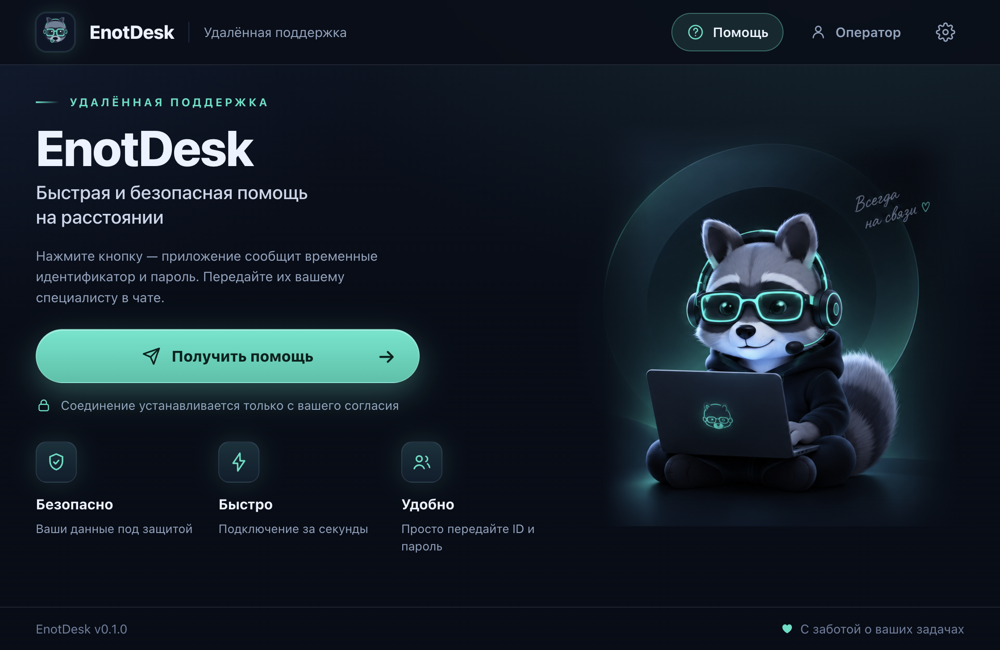

# EnotDesk

English | [Русский](README.ru.md)

[](https://github.com/Flint-sega/enotdesk/actions/workflows/test.yml)

EnotDesk is a portable remote-support application for Windows, macOS and Linux, licensed under **AGPL-3.0** and designed for self-hosting. The person receiving help runs the program with no installation, gets a one-time ID and password, and passes them to the operator through their usual chat. The operator connects, sees the screen and controls mouse and keyboard. Closing the application immediately ends access — no services, no autostart, no background processes.

This is an original Electron + WebRTC application, not a RustDesk fork (see docs/adr/0001-original-electron-webrtc.md, in Russian).

## Screenshots

Main window — the client side with the one-time ID/password for the operator (smoke screenshot of the packaged build):



## How it works

- **Client (receives help):** runs the portable app → “Get help” → shares the one-time ID and password with the operator via their own chat → approves the specific operator’s connection → chats, can hide the screen with one button (pause streaming) and switch the shared screen on the fly → closes the window when done. Access exists only while the app is open.
- **Operator (provides help):** signs in on the EnotDesk server → takes the ID/password from the chat (paste the whole message — fields fill themselves) → connects → after the client’s consent sees the screen and controls input (keyboard works on any layout). During the session: chat, two-way clipboard sync, file transfer, session timer and connection-quality indicator; session history and audit log with CSV export.
- **Transport:** video — WebRTC (DTLS/SRTP) peer-to-peer; signaling — through your EnotDesk server; input, chat, clipboard and files — over DataChannels with strict allowlists and size limits. A short network drop does not kill the session: 30 seconds (configurable) to reconnect with the same tokens; before consent the session ends immediately.

## Quick start

### One-line install (server)

Interactive wizard on a fresh Ubuntu/Debian host (or any host with Docker): asks for domain, admin login/name/password (empty password = autogenerated and printed once), port and firewall, generates the TURN and `ENOT_SECRET_KEY` secrets itself, then installs the server, waits for health and creates the first admin. Passwords and secrets travel only via stdin pipes and process environment — never argv or logs.

```bash
curl -fsSL https://raw.githubusercontent.com/Flint-sega/enotdesk/main/scripts/quick-setup.sh | sudo bash
```

Variants: `--docker` (compose stack in `./enotdesk-docker`), `--tarball <path>` (local build instead of a GitHub release), `--update` (upgrade; defaults from the existing installation), `--dry-run` (print the plan, change nothing), `--hub` / `--no-hub` (enable or skip EnotDesk Hub; without a flag it is asked interactively), and non-interactive flags for CI (`--domain --admin-login --admin-name --port --no-firewall --admin-password-stdin`). See [`scripts/quick-setup.sh --help`](scripts/quick-setup.sh) and [`docs/SERVER.md`](docs/SERVER.md).

### Docker (recommended)

```bash
git clone https://github.com/Flint-sega/enotdesk.git
cd enotdesk/docker
docker compose up -d
```

One command brings up the EnotDesk server, [coturn](https://github.com/coturn/coturn) (TURN for difficult NATs) and Caddy (automatic HTTPS) — see the README in [`docker/`](docker/) for ports, volumes and env.

### Bare metal

Requires Node.js ≥ 24.12. Full server installation guide (Ubuntu/Debian install script, systemd, updates, backups, HTTPS): [`docs/SERVER.md`](docs/SERVER.md).

```bash
npm install          # koffi, ws; electron and electron-builder are exact-pinned in the lockfile
npm run server       # control plane on 127.0.0.1:8080 (SQLite)
npm run bootstrap    # first admin (interactive; never overwrites an existing one)
npm start            # EnotDesk desktop app (Electron)
```

Then in the app: sign in as operator (or press “Get help” on the client side) → default server address `http://127.0.0.1:8080`. Plain HTTP must be explicitly allowed in client settings and is meant for testing only; use HTTPS for anything reachable from the internet. A full control-plane smoke run (bootstrap → login → invite → session → claim → consent → signaling): `npm run smoke:local`.

Downloads page: a deployed server serves built installers at `/downloads` — it lists only artifacts that actually exist in `dist/` (name-allowlisted), never fake links.

## EnotDesk Hub (tickets & chat)

EnotDesk Hub is an optional companion service for support teams: a ticket inbox with a live chat widget for your website, one-click "connect" links, and an email-to-ticket channel. It keeps its own SQLite database (`hub.db`) and talks to the EnotDesk server over its REST API; agents sign in to the browser console at `/hub/` with their regular EnotDesk accounts (2FA included, roles respected).

Install it together with the server:

- one-line install: quick-setup asks whether to enable the Hub (`--hub` / `--no-hub` fix the choice for CI);
- docker: add `COMPOSE_PROFILES=hub` and `HUB=1` to `.env`, then `docker compose up -d` — Caddy routes `/hub`, `/widget.js`, `/w`, `/join` and `/api/hub/*`; the hub port itself is not published;
- from sources: `node hub/main.mjs` (listens on `127.0.0.1:8090`).

Embed the chat widget on any page with one script line (`data-server` points at the hub origin):

```html
<script src="https://hub.example/widget.js" data-server="https://hub.example"></script>
```

One-click help: an agent drops a "Connect" card into a chat thread; on the visitor's machine the `enotdesk://` protocol opens the installed EnotDesk client (registered by the packaged builds on all three OSes), which starts a session and reports it back — the hub auto-claims it for that agent. If the client is not installed, the `/join` fallback page offers the protocol button plus a download link.

Email channel: point the hub at a real IMAP mailbox and SMTP account in the admin settings ("Test connection" checks both). Incoming mail becomes tickets, agent replies go out over SMTP with proper `In-Reply-To` threading, and auto-generated mail from your own addresses (bounces, autoresponders) is skipped. Mailbox passwords are stored encrypted — this requires `ENOT_SECRET_KEY`.

Live acceptance checklist for all of the above: [`docs/MANUAL-QA.md`](docs/MANUAL-QA.md), section "EnotDesk Hub (живая приёмка)".

## Security notes

- **Unsigned builds.** Releases are not code-signed yet — see “Unsigned builds” below for run instructions and why the OS warnings appear.
- **Network.** The server listens on `127.0.0.1:8080` by default; exposing it requires HTTPS/WSS (Caddy in the docker setup, or your own reverse proxy — see SERVER.md). TURN credentials are issued only to authenticated session participants.
- **Data.** Passwords and tokens are stored in the database only as hashes; secrets never reach the renderer process (`contextIsolation: true`, `sandbox: true`, communication only via the preload bridge). Never commit your `.env`.
- **Protocol.** Keys, buttons, scroll deltas and SDP sizes are allowlisted and bounded; file serving is name-allowlisted and rejects path traversal; input decisions belong to the main process behind a WS-state gate, never to renderer claims.
- **Honest status.** Unavailable platform features report `native-unavailable` / `wayland-unsupported-control` instead of pretending to work. Input injection on Wayland is not supported (use X11).

## Platforms

| Platform | Build (npm run) | Artifact | Verified |
|---|---|---|---|
| macOS (arm64) | `pack:mac` | `dist/EnotDesk-mac-arm64.zip` with portable `EnotDesk.app` | Yes: build, run, smoke screenshot |
| Windows | `pack:win` | portable `.exe` | Not yet: configured, but not exercised on a live Windows machine |
| Linux | `pack:linux` | `AppImage` | Not yet: configured, but not exercised on a live Linux machine |

Artifacts are branded EnotDesk (`assets/icon.icns` / `icon.ico` / `icon.png`).

## Releases and updates

Pushing a tag `v…` runs [.github/workflows/release.yml](.github/workflows/release.yml): the three platforms are packed on GitHub runners, lint and tests gate the build, and the artifacts are attached to a GitHub Release together with `checksums-sha256.txt` (verify with `sha256sum -c`) and the auto-update feed files (`latest-mac.yml`, `latest.yml`, `latest-linux.yml`).

The packaged client checks that feed once a day (electron-updater, generic provider): on macOS and Linux the update downloads in the background and applies on the next restart — never in the middle of a session. On Windows the v1 build is a portable `.exe` that cannot replace itself, so the client shows a notification with a link to the releases page. The updater is disabled in development (`npm start`), smoke runs (`EDESK_SMOKE=1`) and the headless agent.

## Unsigned builds

Releases are not code-signed yet (no certificate budget); enabling signing later requires no rework — the secrets block is prepared and commented in release.yml. OS warnings on first launch are expected, here is the short way to run:

- **macOS**: right-click `EnotDesk.app` → “Open” → “Open”; if it stays blocked, `xattr -cr /path/to/EnotDesk.app` removes the quarantine flag. Grant Screen Recording and Accessibility permissions on first launch (see [docs/BUILD.md](docs/BUILD.md)).
- **Windows**: SmartScreen → “More info” → “Run anyway”.
- **Linux**: `chmod +x EnotDesk-linux-*.AppImage` and run it.

## Development

```bash
npm test          # 481 node:test tests: server + hub HTTP/WS + client lib shims + renderer contract
npm run lint      # ESLint
npm run smoke:local
```

CI runs lint + tests on an ubuntu/windows/macos matrix (smoke on ubuntu); Windows/macOS jobs are non-blocking while those adapters are verified manually (see the Platforms table). Stack: Node 24 ESM, no frameworks — `ws` + `koffi` only, Electron 44 (exact pins — do not bump casually), `node:test`, ESLint. Native input goes through koffi adapters: Windows SendInput, macOS CoreGraphics, Linux X11/XTest.

Architectural decisions live in [`docs/adr/`](docs/adr/) (in Russian); project conventions for agents/maintainers in [AGENTS.md](AGENTS.md).

## Community

- Contributing — [CONTRIBUTING.md](CONTRIBUTING.md)
- Report a vulnerability (private channel) — [SECURITY.md](SECURITY.md)
- Code of Conduct — [CODE_OF_CONDUCT.md](CODE_OF_CONDUCT.md)
- Documentation on this README is in Russian where noted; the full Russian readme is [README.ru.md](README.ru.md)

## License

Copyright © 2026 the EnotDesk authors.

This program is free software: you can redistribute it and/or modify it under the terms of the **GNU Affero General Public License** as published by the Free Software Foundation, either version 3 of the License, or (at your option) any later version — see [LICENSE](LICENSE). AGPL-3.0 is chosen so that anyone offering EnotDesk as a network service must share the source of their modified version. Assets are original artwork (see assets/README.md); bundled dependencies keep their own licenses (electron MIT, ws MIT, koffi MIT).
